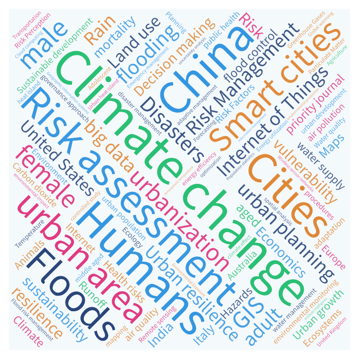

# Word-Cloud-on-Urban-Issues 方法

some simple stats from Scopus on urban issues

## 数据来源

本统计以Elsevier的摘要和应用数据库[Scopus](https://www.scopus.com/)作为数据来源，所选文献均是**标题**、**摘要**以及**关键词**中匹配检索关键词的文章，时间范围是**2012年（含）以来**的文章。

## 方法

本统计利用Scopus自带的文献检索以及信息输出功能，检索命令分别如下：

```
TITLE-ABS-KEY ( "smart city" )  AND  PUBYEAR  >  2011 
```
```
TITLE-ABS-KEY ( "urban resilience" )  AND  PUBYEAR  >  2011 
```
```
TITLE-ABS-KEY ( "urban water" )  AND  PUBYEAR  >  2011 
```
```
TITLE-ABS-KEY ( "urban" )  OR  TITLE-ABS-KEY ( "city" )  AND  TITLE-ABS-KEY ( "climate change" )  AND  PUBYEAR  >  2011 
```
```
TITLE-ABS-KEY ( "urban" )  OR  TITLE-ABS-KEY ( "city" ) AND TITLE-ABS-KEY ( "risk management" )  AND  PUBYEAR  >  2011
```
```
TITLE-ABS-KEY ( "urban" )  OR  TITLE-ABS-KEY ( "city" ) AND TITLE-ABS-KEY ( "risk map" )  AND  PUBYEAR  >  2011
```

在检索所得文献中，本统计以引用量作为排序标准，从高到低进行排序，并导出前2000篇文献的作者关键词（`author keywords`）和索引关键词（`index keywords`）进行统计；不足2000篇文献时则选取所有文献进行输出统计。

以上各命令在下文中分别简称`q-smart-city`、`q-urban-resilience`、`q-urban-water`、`q-climate-change`、`q-risk-management`、`q-risk-map`，输出的详细原始文件请见`\data-raw`目录下的对应文件。

## 结果

以上检索命令匹配出来的文献数量分别为：

| 命令                           | 文献数量      
| ---------------------------      | ----------- |
| `q-smart-city`                   | 27,817      |
| `q-urban-resilience`             |  1,041      |
| `q-urban-water`                  |  4,825      | 
| `q-climate-change`               | 17,892      |
| `q-risk-management`              |  3,704      |
| `q-risk-map`                     |    525      |

按照上文所述方法，最终入选文献的数量（经去重）为7358篇，见[`data-dub-removed.csv`](data-dub-removed.csv)。提取出文献的作者关键词（`author keywords`）和索引关键词（`index keywords`）总计36161个，见[`data-all-keywords.csv`](data-all-keywords.csv)。

在对36161个关键词分析，合并英文中单复数的分开统计后，抽取出现频次最高的前100个关键词，见[`data-top-100-keywords.csv`](data-top-100-keywords.csv)。

将以上关键词倒入wordart.com，并根据出现频次设置字体大小，生成结果如下：




以上结果可见：https://wordart.com/h31kvidp5p9s/urban-issues
